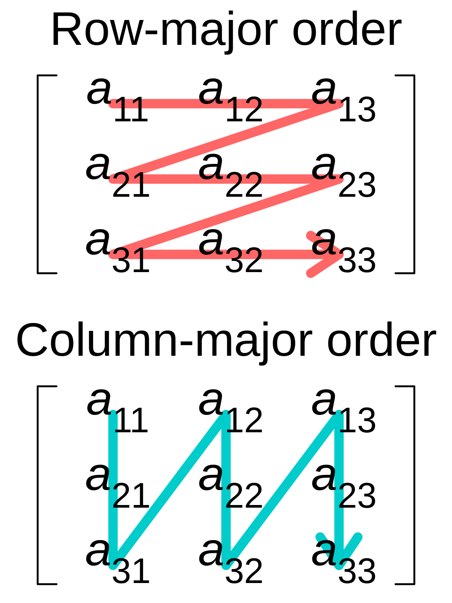
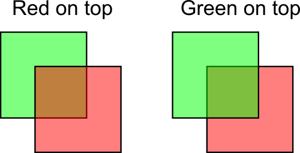

# Table of Contents

1.  [But de ce TP](#org5ca6fa7)
2.  [Les tests pas à pas](#orgcc3ea9d)
    1.  [Tests 01\*: Image](#org070f271)
    2.  [Test 02: Image IO](#org44181b0)
    3.  [Test 03: Procedural Images](#org9071b63)
    4.  [Test 04: Pixels](#org8a2d36a)
    5.  [Test 05: Combiner des images](#orgb8302e6)
        1.  [color blending](#orgee5ef60)
        2.  [Luma as alpha mask](#org4916308)

# But de ce TP

Les images sont des tableaux de **pixels**.
On va utiliser des templates pour définir des images de **taille statique** utilisant plusieurs types de pixels.
Tout au long tu TP, votre code produira des images dans le dossier `images` situé dans votre dosser de build (pas celui à la racine de votre dossier).

# Les tests pas à pas

## TODO Tests 01\*: Image

*On travaillera dans image.hpp*

On définit une classe template `Image<typename P, size_t W, size_t H>` où (W,H) est la dimension de l'image et P le type utilisé pour les pixels (au début on utilisera des entiers simples).

Attention, l'image doît être stockée en **lignes** et pas en **colones**.

On appelle ****row-major**** une image qui est stockée ligne par ligne et ****column-major**** une image qui est stockée colone par colone. Voici un schéma explicatif:

On se place donc dans le cas en rouge.

Vous utiliserez un std::array nesté `std::array<std::array<P, W>, H>` pour stocker les pixels.

On doit avoir:

-   un constructeur `Image(const P & pix)` prenant un pixel de remplissage et construisant une image unie
-   un constructeur par défault `Image()` (on a pas besoin d'initialiser les pixels, vous pouvez utiliser `default`)

On veut aussi pouvoir utiliser img(i,j) pour accéder au pixel de la j-ème ligne et de la i-ème colone, on va pour cela implémenter:

-   `P & operator(const size_t i, const size_t j)`
-   `const P & operator(const size_t i, const size_t j) const`

Ensuite, on veux pouvoir additioner deux image de même tailles, en additionants les pixels un par un.
Ainsi on aura $(img_1 + img_2)(i,j) = img_1(i,j) + img_2(i,j)$.
Overloadez l'opérateur + hors de la classe, ça sera plus facile pour la suite.

Ajoutez le constructeur:

    Image<P, W, H>(const std::function<P(const size_t i, const size_t j)> & functor)
    {
        // todo
    }

Où functor(i,j) est une valeur de pixel à mettre en (i,j).

## TODO Test 02: Image IO

Rien à faire.

## TODO Test 03: Procedural Images

Ici rien à faire, regardez juste les images générées dans build/images.
(ne confondez pas avec le dossier images à la racine de votre projet).

## TODO Test 04: Pixels

*On travaillera dans pixels.hpp*

On va définir nos propres types de pixels: les `struct` RGBA, RGB, et Luma.

<table border="2" cellspacing="0" cellpadding="6" rules="groups" frame="hsides">

<colgroup>
<col  class="org-left" />

<col  class="org-right" />

<col  class="org-left" />
</colgroup>
<thead>
<tr>
<th scope="col" class="org-left">&#xa0;</th>
<th scope="col" class="org-right">Nombre de canaux/taille en octets</th>
<th scope="col" class="org-left">Description</th>
</tr>
</thead>

<tbody>
<tr>
<td class="org-left">RGBA</td>
<td class="org-right">4</td>
<td class="org-left">Rouge,Vert,Bleu,Alpha</td>
</tr>

<tr>
<td class="org-left">RGB</td>
<td class="org-right">3</td>
<td class="org-left">Rouge,Vert,Bleu</td>
</tr>

<tr>
<td class="org-left">Luma</td>
<td class="org-right">1</td>
<td class="org-left">Niveau de Gris</td>
</tr>
</tbody>
</table>

Une `struct` c'est comme une `class` sauf que tout est publique par défaut dedans et que l'instanciation d'une struct ne peux pas valoir NULL.

Implémentez ces trois `struct`, en utilisant le type uint8t ou unsigned char (les deux correspondant à un entier non-signé sur 8 bits) pour les valeurs des canaux.

On va ensuite vouloir **convertir** les pixels entre eux.

On va donc créer une fonction template

    template<typename A, typename B>
    A from(const B & stuff);

Implémentez les cas de conversions suivants:

<table border="2" cellspacing="0" cellpadding="6" rules="groups" frame="hsides">

<colgroup>
<col  class="org-left" />

<col  class="org-left" />

<col  class="org-left" />
</colgroup>
<thead>
<tr>
<th scope="col" class="org-left">Entrée</th>
<th scope="col" class="org-left">Sortie</th>
<th scope="col" class="org-left">Méthode</th>
</tr>
</thead>

<tbody>
<tr>
<td class="org-left">RGBA</td>
<td class="org-left">RGBA</td>
<td class="org-left">on retourne juste la valeur qu'on reçoit</td>
</tr>

<tr>
<td class="org-left">RGB</td>
<td class="org-left">RGB</td>
<td class="org-left">on retourne juste la valeur qu'on reçoit</td>
</tr>

<tr>
<td class="org-left">Luma</td>
<td class="org-left">Luma</td>
<td class="org-left">on retourne juste la valeur qu'on reçoit</td>
</tr>

<tr>
<td class="org-left">RGBA</td>
<td class="org-left">RGB</td>
<td class="org-left">on retire le canal alpha</td>
</tr>

<tr>
<td class="org-left">RGB</td>
<td class="org-left">RGBA</td>
<td class="org-left">on met 255 pour le canal alpha</td>
</tr>

<tr>
<td class="org-left">RGB</td>
<td class="org-left">Luma</td>
<td class="org-left">on utilise lib::rgbtograyscale()</td>
</tr>

<tr>
<td class="org-left">Luma</td>
<td class="org-left">RGB</td>
<td class="org-left">on utilise lib::grayscaletorgb()</td>
</tr>

<tr>
<td class="org-left">RGBA</td>
<td class="org-left">Luma</td>
<td class="org-left">On utilise from&lt;RGBA, RGB&gt; et from&lt;RGB,Luma&gt;</td>
</tr>

<tr>
<td class="org-left">Luma</td>
<td class="org-left">RGBA</td>
<td class="org-left">On utilise from&lt;Luma, RGB&gt; et from&lt;RGB,RGBA&gt;</td>
</tr>
</tbody>
</table>

Remarquez qu'on aurait pu avoir l'idée de faire les 3 premiers cas en une seule fois avec

    template<typename A>
    A from(const A & x)
    {
        return x;
    }

Mais attention! c++ n'autorise pas la spécialisation partielle de fonctions templates, et ça n'est donc pas possible (il aurait fallut utiliser une class ou une struct, ce qu'on ne fera pas aujourd'hui).

Pour spécialiser la fonction, suivez ce modèle:

    template<>
    RGBA from(const RGB & x)
    {
        return {x.r,x.g,x.b,255};
    }

## TODO Test 05: Combiner des images

On veut pouvoir additioner les différents pixels qu'on a définit pour pouvoir combiner des images.
On peut:

-   soit *blender* les couleurs de deux pixels (en utilisant la fonction mixcolor de la lib du TP)
-   soit se servir de l'image de droite comme un *masque de transparence*.

On va se servir de la fonction lib::mixcolor pour le blending.
L'idée est de faire une "superposition" d'une image par une autre, la fonction mixcolor n'est donc pas symétrique.

Appliquer le masque de transparence B sur une image A voudra dire pour nous “remplacer le canal alpha de A par B„ (B sera donc une image à un seul canal).
Voici un exemple parlant:

On va se baser sur ce tableau pour savoir quoi faire:

<table border="2" cellspacing="0" cellpadding="6" rules="groups" frame="hsides">

<colgroup>
<col  class="org-left" />

<col  class="org-left" />

<col  class="org-left" />

<col  class="org-left" />
</colgroup>
<thead>
<tr>
<th scope="col" class="org-left">A</th>
<th scope="col" class="org-left">B</th>
<th scope="col" class="org-left">effet</th>
<th scope="col" class="org-left">Type sortant C</th>
</tr>
</thead>

<tbody>
<tr>
<td class="org-left">RGBA</td>
<td class="org-left">RGBA</td>
<td class="org-left">blending</td>
<td class="org-left">RGBA</td>
</tr>

<tr>
<td class="org-left">RGB</td>
<td class="org-left">RGBA</td>
<td class="org-left">blending</td>
<td class="org-left">RGB</td>
</tr>

<tr>
<td class="org-left">Luma</td>
<td class="org-left">RGBA</td>
<td class="org-left">blending</td>
<td class="org-left">RGB</td>
</tr>

<tr>
<td class="org-left">RGBA</td>
<td class="org-left">RGB</td>
<td class="org-left">blending</td>
<td class="org-left">RGBA</td>
</tr>

<tr>
<td class="org-left">RGB</td>
<td class="org-left">RGB</td>
<td class="org-left">blending</td>
<td class="org-left">RGB</td>
</tr>

<tr>
<td class="org-left">Luma</td>
<td class="org-left">RGB</td>
<td class="org-left">blending</td>
<td class="org-left">RGB</td>
</tr>

<tr>
<td class="org-left">tout</td>
<td class="org-left">Luma</td>
<td class="org-left">masque de transparence</td>
<td class="org-left">RGBA</td>
</tr>
</tbody>
</table>

### color blending

Commencez par implémenter, le premier cas du tableau.

    RGBA
    operator+(const RGBA & lhs,
              const RGBA & rhs)
    {
        // TODO
    }

On va par la suite implémenter tous les autres cas de blending en utilisant ce premier cas, en utilisant `from` pour transformer les pixels d'entrée en RGBA et convertir la sortie en le type attendu.

Astuce: si vous êtes en confiance et que vous avez du temps, vous pouvez vous arranger écrire une macro avec `#define` pour ne pas avoir à réécrire 6 fois la même fonction.

Vous auriez quelque chose comme ça:

    IMPL_ADD(RGBA, RGBA, RGBA);
    IMPL_ADD(RGBA, RGB , RGBA);
    IMPL_ADD(RGB , RGBA, RGB );
    IMPL_ADD(Luma, RGBA, RGBA);
    IMPL_ADD(Luma, RGB , RGB);
    IMPL_ADD(RGB , RGB , RGB);

Vous pouvez vous passer de la macro (c'est d'ailleurs conseillé si vous n'êtes pas en avance).

### Luma as alpha mask

Pour celle-là, il suffit d'écrire que cette fonction template sans spécialisation:

    // mask operator
    template<typename A>
    RGBA
    operator+(const A    & lhs,
              const Luma & mask)
    {
        // todo
    }

Il est attendu que la sortie soit toujours du RGBA (vu que c'est le seul type de pixel ayant de la transparence).
La valeur alpha de la sortie sera celle de lhs fois la valeur de gris de mask, le tout divisé par 255.

*On se remet dans image.hpp*

Normalement à ce stade, il manque une chose: revenez à Image et regardez l'opérateur+

    template<const size_t W, const size_t H,
             typename A, typename B>
    Image<A, W, H>
    operator+(const Image<A, W, H> & lhs,
              const Image<B, W, H> & rhs)
    {
        // des trucs
    }

Remarquez que le type de retour est le même que le type à gauche. Hors on veut ajouter ces exceptions:

<table border="2" cellspacing="0" cellpadding="6" rules="groups" frame="hsides">

<colgroup>
<col  class="org-left" />

<col  class="org-left" />

<col  class="org-left" />
</colgroup>
<thead>
<tr>
<th scope="col" class="org-left">A</th>
<th scope="col" class="org-left">B</th>
<th scope="col" class="org-left">Sortie</th>
</tr>
</thead>

<tbody>
<tr>
<td class="org-left">tout</td>
<td class="org-left">Luma</td>
<td class="org-left">RGBA</td>
</tr>
</tbody>
</table>

Il suffit de rajouter une spécialisation de l'opérateur + de image qui fait à peu près la même chose que la première, mais qui sans le type B (on sait déjà que c'est Luma) et avec RGBA comme type de retour.

À ce stade, vous pouvez regarder les images générées dans build/images: votre code produit des montages à partir des fonctionalitées que vous avez implémenté!

